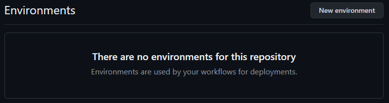
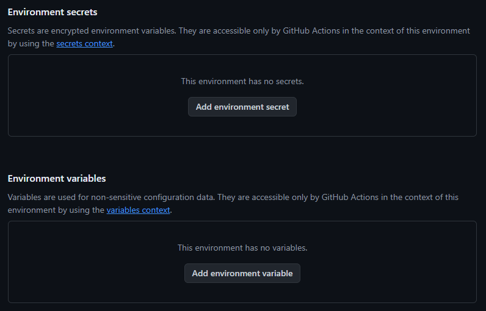
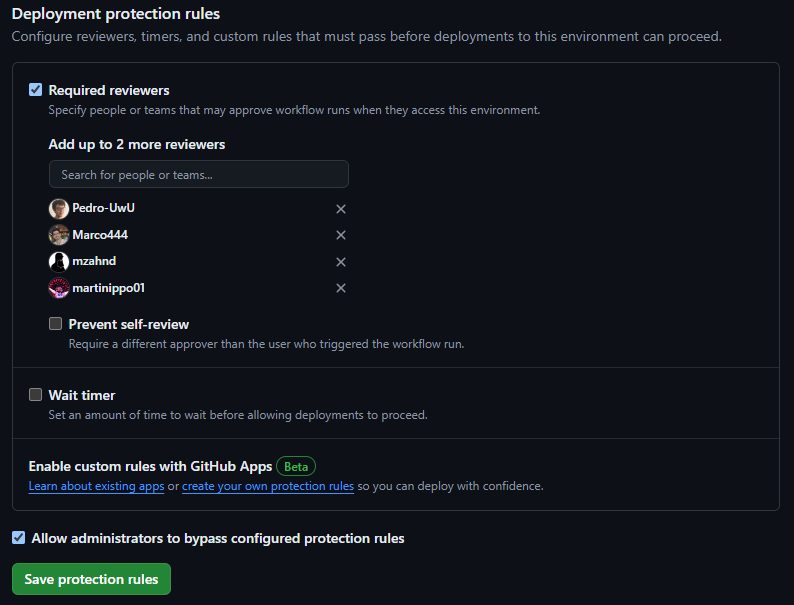

# CI/CD with GitHub Actions: Step-by-Step Guide

## Introduction

This guide will walk you through setting up a CI/CD pipeline using GitHub Actions. Our pipeline will build code, run unit tests, deploy to a container, and handle notifications and manual approvals. Additionally, we'll set up multi-environment deployments.

## Prerequisites

1. **Git and GitHub Account**: Ensure you have Git installed and a GitHub account.
2. **Docker**: Install Docker to manage containers.
3. **AWS Account (Optional)**: For deploying using AWS services like EKS, ECS, or Lambda.

Side note: This guide and demo will deploy to AWS, but this is not required for using CI/CD with github actions.

# First steps

In order to understand the basics of GitHub actions, we will make a 'hello world' example, where on a simple push to the main 
branch will start an action with the title of the user that made the push.

## Step 1: Create a GitHub Repository

1. Go to [GitHub](https://github.com) and log in.
2. Click on the **+** icon and select **New repository**.
3. Name your repository, provide a description, and click **Create repository**.

For new github users, check out the [GitHub documentation on repositories](https://docs.github.com/en/repositories/creating-and-managing-repositories/quickstart-for-repositories)

## Step 2: Set Up GitHub Actions

1. Clone your repository localy ([GitHub documentation on cloning a repository](https://docs.github.com/en/repositories/creating-and-managing-repositories/cloning-a-repository))
2. Step into the root of the repository. To make sure you are in the root, run `ls -a` and you should see a directory named `.git`
3. Inside the directory `./.githubactions/workflows`, create a file `ci-cd.yml` (Create both directories if necessary)

## Step 3: Create a new workflow

Inside the file created, copy the following code:
```yaml
name: GitHub Actions Demo
run-name: ${{ github.actor }} is testing out GitHub Actions 🚀

on:
  push:
    branches:
      - main

jobs:
  Explore-GitHub-Actions:
    runs-on: ubuntu-latest
    steps:
      - run: echo "🎉 The job was automatically triggered by a ${{ github.event_name }} event."
      - run: echo "🐧 This job is now running on a ${{ runner.os }} server hosted by GitHub!"
      - run: echo "🔎 The name of your branch is ${{ github.ref }} and your repository is ${{ github.repository }}."
      - name: Check out repository code
        uses: actions/checkout@v4
      - run: echo "💡 The ${{ github.repository }} repository has been cloned to the runner."
      - run: echo "🖥️ The workflow is now ready to test your code on the runner."
      - name: List files in the repository
        run: |
          ls ${{ github.workspace }}
      - run: echo "🍏 This job's status is ${{ job.status }}."
```
4. Remeber to save all changes
5. Commit and push the changes to origin (the github repository created)

In order to check that the action created was successfuly created, open your repository on GitHub and select the _actions_ tab. You should be able to see the action running or completed.


## Understanding the workflow
### name and run-name
The first two lines define the name of the workflow `name: GitHub Actions Demo`, and the title of each run of the workflow `run-name: ${{ github.actor }} is testing out GitHub Actions 🚀`.

GitHub provides parameters such as actor, action, etc. You can find the all in the [GitHub Actions documentation on contexts](https://docs.github.com/en/actions/learn-github-actions/contexts).

### Trigger

The next section defines how the workflow is triggered.
```yaml
on:
  push:
    branches:
      - main
```
Basically, the action will only be triggered when a push to the main branch is made. This can be on push, pull requests, issues, etc. Find more in [events that trigger workflows (GitHub Documentation)](https://docs.github.com/en/actions/using-workflows/events-that-trigger-workflows). 

### Jobs
A workflow run is made up of one or more jobs, which **run in parallel by default**. To run jobs sequentially, you can define dependencies on other jobs indicating that a given job `needs` another job.

Inside the workflow, the element `jobs` has a series of individual jobs identified by an `id`. 

<u>**Fields:**</u>
- `runs-on`: To define the type of machine to run the job on.
- `needs`: Is an optional field, which indicates that the job needs another job to finish in order to start the current one. 
- `steps`: A list of steps that the job will execute. Each step can either run a script or use an action.

```yaml
jobs:
  job-1:
    runs-on: ubuntu-latest
    steps:
      ...
  job-2:
    runs-on: ubuntu-latest
    needs: job-1
    steps:
      ...

```

### Steps
A job contains a sequence of tasks called steps. Steps can run commands, run setup tasks, or run an action in your 
repository, a public repository, or an action published in a Docker registry.

Each step has many fields, but the key ones are:

- `name`: A name for your step to display on GitHub.
- `uses`: Selects an action to run as part of a step in your job. An action is a reusable unit of code. You can use an action defined in the same repository as the workflow, a public repository, or in a published Docker container image.
- `with`: A map of the input parameters defined by the action. Each input parameter is a key/value pair. Input parameters are set as environment variables.
- `run`: Runs command-line programs.

**For example**:
```yaml
jobs:
  terraform-init:
    steps:
      - name: Checkout repository
        uses: actions/checkout@v4

      - name: Set up Terraform
        uses: hashicorp/setup-terraform@v1
        with:
          terraform_version: 1.0.0
          ...
```
>
> We strongly recommend to read [Workflow syntax for GitHub Actions](https://docs.github.com/en/actions/using-workflows/workflow-syntax-for-github-actions), to find more about the basics on name, triggers, jobs and steps


### Checkout code

This action checks-out your repository so your workflow can access and work with it. It basically clones the repository for you.

```yaml
      - name: Checkout repository
        uses: actions/checkout@v4
```

# Example of GitHub Workflows

## Running unit tests

One of the most common usages is to run unit tests on pushes to main or Pull Request, so that they run automatically.

In order to show a basic example, this repository contains a basic JavaScript Project whit test that are intended to run with Jest. However, this can be done with other languges, frameworks, etc. (Java with maven, React, etc). The only requiremnet is that the unit tests can be runned using a command-line.

### Unit tests workflow file

Create the `unit_tests.yml` file inside the `.github/workflows` folder. For this example, we want the workflow to only run when a pull request is created, updated, or reopened and only when the pull requests wants to be merged to main.

```yaml
name: Run Unit Tests

on:
  pull_request:
    branches:
      - main
```

Then, a single job will be created, where we will install the dependencies and run the tests, as we would do on our local machine. In this case is javascript running `npm`, but it could be java using maven and many more other options.

```yaml
  jobs:
    test:
      runs-on: ubuntu-latest

      steps:
        - name: Checkout repository
          uses: actions/checkout@v4

        - name: Set up Node.js
          uses: actions/setup-node@v3
          with:
            node-version: '16'

        - name: Install dependencies
          run: npm install

        - name: Run tests
          run: npm test

  ```
  In this case, there are four steps:
  - Doing the repository checkout (That we have explained before)
  - Use the action `setup-node@v3` in order to set up the version of Node we need. This could be changed for another action intended for configuring the versions of Java, Python, etc.
  - 'Install dependencies' and 'Run tests' That just runs the commands indicated with the key `run`.

## Send notifications

It can be very useful to send notifications to the team upon successful or failed workflows. Notifications can be send to diverse services such as Slack, Discord, Microsoft Teams or just email.

### Slack notifications

In case your team uses Slack, you will need to create a App and create an incoming webhook for it. Here's a step by step guide at the [Slack api Documentation](https://api.slack.com/messaging/webhooks).

Here's the step you need to add to send a notification via slack to a specific channel.

```yaml
  steps:
    
    ...

    - name: Send custom JSON data to Slack workflow
      id: slack
      uses: slackapi/slack-github-action@v1.26.0
      with:
        payload: |
          {
            "text": "GitHub Action build result: ${{ job.status }}\n${{ github.event.pull_request.html_url || github.event.head_commit.url }}",
            "blocks": [
              {
                "type": "section",
                "text": {
                  "type": "mrkdwn",
                  "text": "GitHub Action build result: ${{ job.status }}\n${{ github.event.pull_request.html_url || github.event.head_commit.url }}"
                }
              }
            ]
          }
      env:
        SLACK_WEBHOOK_URL: ${{ secrets.SLACK_WEBHOOK_URL }}
        SLACK_WEBHOOK_TYPE: INCOMING_WEBHOOK
```

>
> It is strongly recommneded to store the Slack Webhook as a repository secret. See the [GitHub documentation about secrets](https://docs.github.com/es/actions/security-guides/using-secrets-in-github-actions).
>

### Email notifications

The action shown to send emails is based on the SMTP protocol. This implies that you will need to configure the secrets for the following fields:
- `SMTP Server` and `SMTP Port`: Server to use to send the email.
- `SMTP username` and `SMTP password`: Credentials of the email to authenticate with the SMTP server.

```yaml
    - name: Send Email Notification
      uses: dawidd6/action-send-mail@v3
      with:
        server_address: ${{ secrets.SMTP_SERVER }}
        server_port: ${{ secrets.SMTP_PORT }}
        username: ${{ secrets.SMTP_USERNAME }}
        password: ${{ secrets.SMTP_PASSWORD }}
        subject: GitHub Actions Notification
        body: A new push to the main branch has been made.
        to: devops@example.com, devs@example.com, cto@example.com
        from: ${{ secrets.SMTP_USERNAME }}
```

>
> How you obtain these fields depends on the email service that is used.
>

>
> In case you use a gmail accounte to send the email from, take into account that it might be required to set up an App Password instead of using the Google account password.
>

# Environments

GitHub provides environments for a repository so that it can deploy in different contexts. This is achieved by configuring the same secrets with differente values in each environment.

Furthermore it allows to have a select group of people that can approve a deployment before it starts.



Inside a job, the `environment` field sets up the job to run in the specified context.

```yaml
jobs:
  deploy-dev:
    runs-on: ubuntu-latest
    environment: dev
```

## Distintos ambientes

In the repositry settings, you will find the section `environments` where you can set up secrets that will apply only when the environment context is selected.



## Aprobacion manual

You can specify people or teams that may approve workflow runs when they access this environment. This are inside the section `Deployment protection rules`.



# Complete demo
A full demonstration of all the features and concepts shown here is available at [lendaread/CI-CD](https://github.com/lendaread/CI-CD).